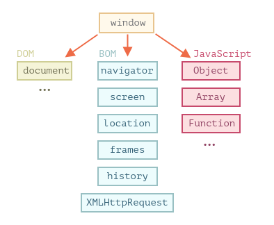
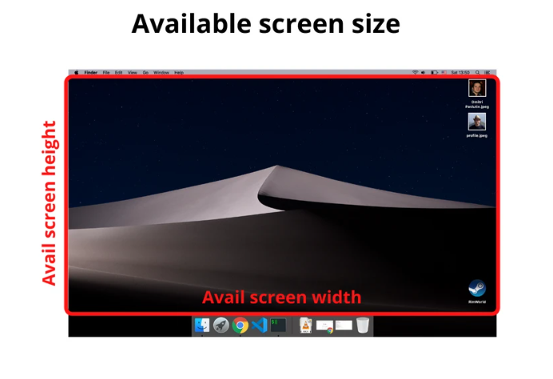
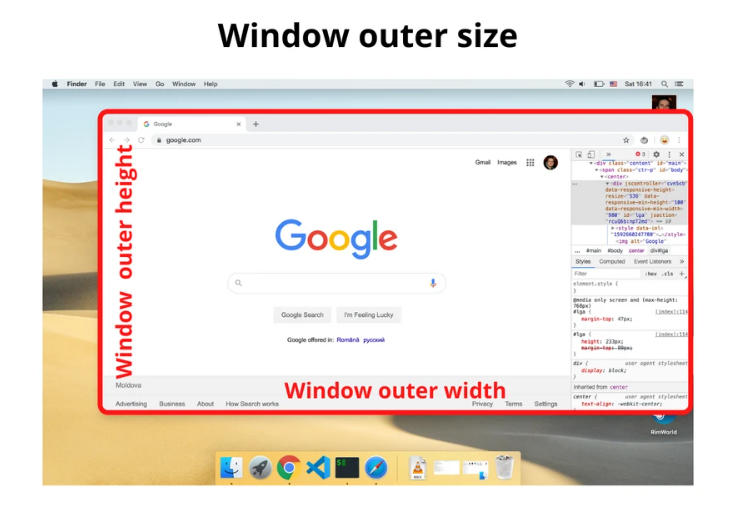
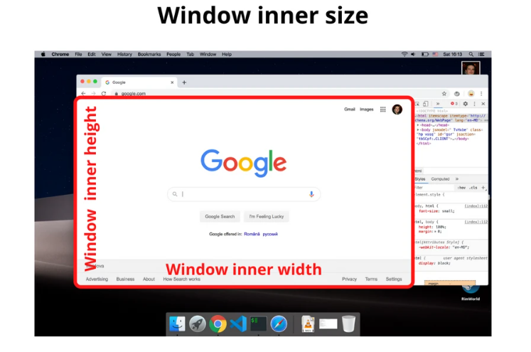
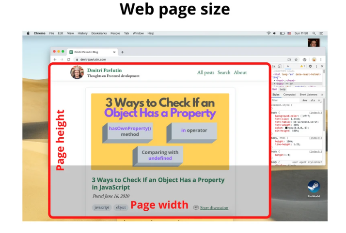

# # 12. WINDOW/DOCUMENT OBJECT

<br/>

## Q 12.1. What is the difference between window and document object?

**1. Window Object**: 

The window object is the topmost object of the DOM hierarchy. It represents a browser window or frame that displays the contents of the webpage. Whenever a window appears on the screen to display the contents of the document, the window object is created.

**Syntax:**

```js
window.property_name;
```

**Window Object Properties:**

|Property	        |Description                            |
|-----------------|---------------------------------------|
|closed	          |Returns a boolean true if a window is closed.|
|console	        |Returns the Console Object for the window.|
|document	        |Returns the Document object for the window.|
|frames	          |Returns all window objects running in the window.|
|history	        |Returns the History object for the window.|
|innerHeight	    |Returns the height of the window's content area (viewport) including scrollbars|
|innerWidth	      |Returns the width of a window's content area (viewport) including scrollbars|
|localStorage	    |Allows to save key/value pairs in a web browser. Stores the data with no expiration date|
|location	        |Returns the Location object for the window.|
|navigator	      |Returns the Navigator object for the window.|
|opener	          |Returns a reference to the window that created the window|
|outerHeight	    |Returns the height of the browser window, including toolbars/scrollbars|
|outerWidth     	|Returns the width of the browser window, including toolbars/scrollbars|
|pageXOffset	    |Returns the pixels the current document has been scrolled (horizontally) from the upper left corner of the window|
|pageYOffset	    |Returns the pixels the current document has been scrolled (vertically) from the upper left corner of the window|
|parent	          |Returns the parent window of the current window|
|screen	          |Returns the Screen object for the window|
|screenLeft	      |Returns the horizontal coordinate of the window relative to the screen|
|screenTop	      |Returns the vertical coordinate of the window relative to the screen|
|screenX	        |Returns the horizontal coordinate of the window relative to the screen|
|screenY	        |Returns the vertical coordinate of the window relative to the screen|
|sessionStorage	  |Allows to save key/value pairs in a web browser. Stores the data for one session|
|scrollX	        |An alias of pageXOffset|
|scrollY	        |An alias of pageYOffset|
|self	            |Returns the current window|
|top	            |Returns the topmost browser window|

**2. Document Object:** 

The document object represent a web page that is loaded in the browser. By accessing the document object, we can access the element in the HTML page. The document object can be accessed with a `window.document` or just `document`.

**Syntax:**

```js
document.property_name;
```

**Document Object Properties:**

|Property       	    |Description                         |
|---------------------|------------------------------------|
|addEventListener()	  |Attaches an event handler to the document|
|baseURI	            |Returns the absolute base URI of a document|
|body	                |Sets or returns the document's body (the `<body>` element)|
|characterSet	        |Returns the character encoding for the document|
|close()	            |Closes the output stream previously opened with document.open()|
|cookie	              |Returns all name/value pairs of cookies in the document|
|createAttribute()	  |Creates an attribute node|
|createElement()	    |Creates an Element node|
|createEvent()	      |Creates a new event|
|createTextNode()	    |Creates a Text node|
|defaultView	        |Returns the window object associated with a document, or null if none is available.|
|designMode	          |Controls whether the entire document should be editable or not.|
|doctype            	|Returns the Document Type Declaration associated with the document|
|documentElement	    |Returns the Document Element of the document (the <html> element)|
|documentURI	        |Sets or returns the location of the document|
|forms	              |Returns a collection of all `<form>` elements in the document|
|getElementById()	    |Returns the element that has the ID attribute with the specified value|
|getElementsByClassName()|	Returns an HTMLCollection containing all elements with the specified class name|
|getElementsByName()	|Returns an live NodeList containing all elements with the specified name|
|getElementsByTagName()|	Returns an HTMLCollection containing all elements with the specified tag name|
|images	              |Returns a collection of all `` elements in the document|
|normalize()	        |Removes empty Text nodes, and joins adjacent nodes|
|open()	              |Opens an HTML output stream to collect output from document.write()|
|querySelector()	    |Returns the first element that matches a specified CSS selector(s) in the document|
|querySelectorAll()	  |Returns a static NodeList containing all elements that matches a specified CSS selector(s) in the document|
|readyState	          |Returns the (loading) status of the document|
|referrer	            |Returns the URL of the document that loaded the current document|
|removeEventListener()|Removes an event handler from the document (that has been attached with the addEventListener() method)|
|title	              |Sets or returns the title of the document|
|URL	                |Returns the full URL of the HTML document|
|write()	            |Writes HTML expressions or JavaScript code to a document|
|writeln()	          |Same as write(), but adds a newline character after each statement|

**Difference:**

| Window | Document |
|------- | ---------|
| It is the root level element in any web page  | It is the direct child of the window object. This is also known as Document Object Model(DOM) |
| By default window object is available implicitly in the page | You can access it via window.document or document.  |
| It has methods like alert(), confirm() and properties like document, location | It provides methods like getElementById(), getElementByTagName(), createElement() etc  |

<div align="right">
    <b><a href="#">↥ back to top</a></b>
</div>

## Q 12.2. How do you access history in javascript?

The `window.history` object allows you to access the history stack of the browser. To navigate to a URL in the history, you use the `back()`, `forward()`, and `go()` methods. The `history.length` returns the number of URLs in the history stack.

**1. Move backward:**

```js
window.history.back();

// Or

history.back();
```

**2. Move forward:**

```js
history.forward();
```

**3. Move to a specific URL in the history:**

To move to a specific URL in the history stack, you use the `go()` method. The `go()` method accepts an integer that is the relative position to the current page. The current page\'s position is `0`.

```js
// to move backward a page
history.go(-1);

// To move forward a page
history.go(1)

// To refresh the current page
history.go(0);
history.go();
```

**4. Check history stack:**

```js
history.length
```

<div align="right">
    <b><a href="#">↥ back to top</a></b>
</div>

## Q 12.3. How do you find operating system details?

The `window.navigator` object contains information about the visitor\'s browser os details. Some of the OS properties are avaialble under platform property,

**Example:**

```js
let OS = "Unknown";

if (navigator.userAgent.indexOf("Win") !== -1) OS = "Windows";
if (navigator.userAgent.indexOf("Mac") !== -1) OS = "MacOS";
if (navigator.userAgent.indexOf("X11") !== -1) OS = "UNIX";
if (navigator.userAgent.indexOf("Linux") !== -1) OS = "Linux";

console.log(OS);
console.log(navigator.userAgent);

// Output
Windows
VM87:8 Mozilla/5.0 (Windows NT 10.0; Win64; x64) AppleWebKit/537.36 (KHTML, like Gecko) Chrome/101.0.0.0 Safari/537.36
```

**&#9885; [Try this example on CodeSandbox](https://codesandbox.io/s/js-os-details-lzppo0?file=/src/index.js)**

<div align="right">
    <b><a href="#">↥ back to top</a></b>
</div>

## Q 12.4. How do you detect a browser language preference?

You can use navigator object to detect a browser language preference as below,

```js
var language = navigator.languages && navigator.languages[0] || // Chrome / Firefox
              navigator.language ||   // All browsers
              navigator.userLanguage; // IE <= 10

console.log(language);
```

<div align="right">
    <b><a href="#">↥ back to top</a></b>
</div>

## Q 12.5. What is BOM?

The Browser Object Model (BOM) allows JavaScript to "talk to" the browser. It consists of the objects navigator, history, screen, location and document which are children of window. The Browser Object Model is not standardized and can change based on different browsers.

<p align="center">
  
</p>

<div align="right">
    <b><a href="#">↥ back to top</a></b>
</div>

## Q 12.6. How do you redirect new page in javascript?

To redirect to a new URL or page, you assign the new URL to the `location.href` property or use the `location.assign()` method. The `location.replace()` method does redirect to a new URL but does not create an entry in the history stack of the browser.

**Example:**

```js
function redirect() {
  window.location.href = 'newPage.html';
}
```

**&#9885; [Try this example on CodeSandbox](https://codesandbox.io/s/js-page-redirect-xc7221?file=/index.html)**

<div align="right">
    <b><a href="#">↥ back to top</a></b>
</div>

## Q 12.7. How to get the current url with javascript?

The `window.location` object can be used to get the current page address (URL) and to redirect the browser to a new page. You can also use `document.URL` for **read-only** purpose.

**Location Properties:**

| Properties | Description                              |
|------------|------------------------------------------|
|href        |returns the href (URL) of the current page|
|hostname    |returns the domain name of the web host|
|pathname    |returns the path and filename of the current page|
|protocol    |returns the web protocol used (http: or https:)|
|assign()    |loads a new document|
|host        |The hostname and port of the URL|
|port        |The port number in the URL|
|search      |The query portion of the URL|
|hash        |The anchor portion of the URL|

**Example:**

```js
console.log('location.href', window.location.href); // Returns full URL
```

**&#9885; [Try this example on CodeSandbox](https://codesandbox.io/s/js-page-redirect-xc7221?file=/index.html)**

<div align="right">
    <b><a href="#">↥ back to top</a></b>
</div>

## Q 12.8. How to get query string values in javascript?

The `URLSearchParams()` provides an interface to work with query string parameters. The `has()` method of the `URLSearchParams()` determines if a parameter with a specified name exists.

**Example:** URLSearchParams()

```js
const urlParams = new URLSearchParams(window.location.search);
const clientCode = urlParams.get('clientCode');
```

The URLSearchParams() methods:

* **keys()** returns an iterator that iterates over the parameter keys.
* **values()** returns an iterator that iterates over the parameter values.
* **entries()** returns an iterator that iterates over the (key, value) pairs of the parameters.

**Example:** keys()

```js
const urlParams = new URLSearchParams('?type=list&page=20');

for (const key of urlParams.keys()) {
    console.log(key);
}

// Output
type
page
```

**Example:** values()

```js
const urlParams = new URLSearchParams('?type=list&page=20');

for (const value of urlParams.values()) {
    console.log(value);
}

// Output
list
20
```

**Example:** entries()

```js
const urlParams = new URLSearchParams('?type=list&page=20');

for (const entry of urlParams.entries()) {
    console.log(entry);
}

// Output
["type", "list"]
["page", "20"]
```

**&#9885; [Try this example on CodeSandbox](https://codesandbox.io/s/js-urlsearchparams-7mb02x?file=/src/index.js)**

<div align="right">
    <b><a href="#">↥ back to top</a></b>
</div>

## Q 12.9. What is difference between window.frames, window.parent and window.top in JavaScript?

* **window.frames** – the collection of "children" windows (for nested frames).
* **window.parent** – property returns the immediate parent of the current window
* **window.top** – returns the topmost window in the hierarchy of window objects

<div align="right">
    <b><a href="#">↥ back to top</a></b>
</div>

## Q 12.10. What are the properties used to get size of window?

**1. The screen size:**

The screen size is the width and height of the screen: a monitor or a mobile screen.

<p align="center">
  
</p>

**Example:**

```js
const screenWidth  = window.screen.width;
const screenHeight = window.screen.height;
```

**2. The available screen size:**

The available screen size consists of the width and height of the active screen without the Operating System toolbars.

<p align="center">
  
</p>

**Example:**

```js
const availScreenWidth  = window.screen.availWidth;
const availScreenHeight = window.screen.availHeight;
```

**3. The window outer size:**

The window outer size consists of the width and height of the entire browser window, including the address bar, tabs bar, and other browser panels.

<p align="center">
  
</p>

**Example:**

```js
const windowOuterWidth  = window.outerWidth;
const windowOuterHeight = window.outerHeight;
```

**4. The window inner size:**

The window inner size (aka viewport size) consists of the width and height of the viewport that displays the web page.

<p align="center">
  
</p>

**Example:**

```js
const windowInnerWidth  = window.innerWidth;
const windowInnerHeight = window.innerHeight;
```

**5. The web page size:**

The web page size consists of the width and height of the page content rendered.

<p align="center">
  
</p>

**Example:**

```js
const pageWidth  = document.documentElement.scrollWidth;
const pageHeight = document.documentElement.scrollHeight;
```

<div align="right">
    <b><a href="#">↥ back to top</a></b>
</div>

## Q 12.11 What are the ways to execute javascript after page load?

You can execute javascript after page load in many different ways, 

**1. window.onload:**

```js
window.onload = function ...
```

**2. document.onload:**

```js
document.onload = function ...
```

**3. body onload:**

```html
<body onload="script();">
```

**4. Defer the script:**

```html
<script src="deferMe.js" defer></script>
```

<div align="right">
    <b><a href="#">↥ back to top</a></b>
</div>

## Q 12.12. What is the difference between document load event and document domcontentloaded event?

**1. DOMContentLoaded:**

The `DOMContentLoaded` event is fired when the initial HTML document has been completely loaded and parsed, without waiting for stylesheets, images, and subframes to finish loading. DOMContentLoaded is a great event to use to hookup UI functionality to complex web pages.

**Example:**

```js
document.addEventListener("DOMContentLoaded", function(e) {
  console.log("DOM loaded!");
});
```

**2. loadEvent:**

The load event fires when all files have finished loading from all resources, including ads and images.

**Example:**

```js
document.addEventListener("load", function(e) {
  console.log("Page loaded!");
});
```

<div align="right">
    <b><a href="#">↥ back to top</a></b>
</div>

## Q 12.13. What do you understand by Screen objects?

* **window**: is the execution context and global object for that context's JavaScript
* **document**: contains the DOM, initialized by parsing HTML
* **screen**: The screen object contains information about the visitor's screen.


| Property    | Description          |
|-------------|----------------------|
|availHeight	|Returns the height of the screen (excluding the Windows Taskbar)|
|availWidth	  |Returns the width of the screen (excluding the Windows Taskbar)|
|colorDepth	  |Returns the bit depth of the color palette for displaying images|
|height	      |Returns the total height of the screen|
|pixelDepth	  |Returns the color resolution (in bits per pixel) of the screen|
|width	      |Returns the total width of the screen|

**&#9885; [Try this example on CodeSandbox](https://codesandbox.io/s/js-screen-object-bxcuo9?file=/src/index.js)**

<div align="right">
    <b><a href="#">↥ back to top</a></b>
</div>

## Q 12.14. How to change style of html element using javascript?

Below is the syntax for manipulating the style property on an HTML element using JavaScript:

**Syntax:**

```js
HTMLElement.style.property = "new style"
```

**1. Using Style Property:**

```js
// Example 01:
document.getElementById("title").style.fontSize = "30px";

// Example 02:
document.getElementById("message").style = "color:#f00;padding:5px;"
```

**2. Using ClassName Property:** 

```js
// Example 01:
document.getElementById("title").style.className = "custom-title";

// Example 02:
const x = document.getElementsByClassName("message");
       
for (i = 0; i < x.length; i++) {
  x[i].style = "padding:20px;border:1px solid #bbb;";
} 
```

<div align="right">
    <b><a href="#">↥ back to top</a></b>
</div>

## Q 12.15. How do you print the contents of web page?

The window object provided print() method which is used to prints the contents of the current window. It opens Print dialog box which lets you choose between various printing options. 

**Example:**

```html
  <input type="button" value="Print" onclick="window.print()" />
```

*Note: In most browsers, it will block while the print dialog is open*.

<div align="right">
    <b><a href="#">↥ back to top</a></b>
</div>

## Q 12.16. How do I modify the url without reloading the page?

The `window.localtion.url` property will be helpful to modify the url but it reloads the page. HTML5 introduced the `history.pushState()` and `history.replaceState()` methods, which allow you to add and modify history entries, respectively. 

**Example:**

```js
window.history.pushState('newPage', 'Title', '/newPage.html');
```

<div align="right">
    <b><a href="#">↥ back to top</a></b>
</div>

## Q 12.17. When would you use `document.write()`?

The **document.write()** method is used to delete all the content from the HTML document and inserts the new content. It is also used to give the additional text to an output which is open by the `document.open()` method. 

The `document.write()` only works while the page is loading; If you call it after the page is done loading, it will overwrite the whole page. This method is mostly used for testing purpose.

**Example:**

```js
document.write("Hello World!");
```

<div align="right">
    <b><a href="#">↥ back to top</a></b>
</div>

## Q 12.18. What is the difference between an attribute and a property?

Attributes are defined on the HTML markup whereas properties are defined on the DOM. For example, the below HTML element has 2 attributes type and value,

```html
<input type="text" value="Name:">
```

You can retrieve the attribute value as below,

```js
const input = document.querySelector('input');
console.log(input.getAttribute('value')); // Good morning
console.log(input.value); // Good morning
```

And after you change the value of the text field to "Good evening", it becomes like

```js
console.log(input.getAttribute('value')); // Good morning
console.log(input.value); // Good evening
```

<div align="right">
    <b><a href="#">↥ back to top</a></b>
</div>

## Q 12.19. What is the difference between firstChild and firstElementChild?

**1. firstChild:**

The firstChild property returns the first child node of the specified node, as a Node object.

```html
<ul id="myList">
    <li>Coffee</li>
    <li>Tea</li>
</ul>
```

```js
let list = document.getElementById("myList").firstChild.innerHTML; // Coffee
```

**2. firstElementChild:**  

The firstElementChild property returns the first child element of the specified element.

```html
<ul id="myList">
  <li>Coffee</li>
  <li>Tea</li>
</ul>
```

```js
let list = document.getElementById("myList").firstElementChild.innerHTML; // Coffee
```

**Difference:**

**firstChild** returns the first child **node** (an element node, a text node or a comment node). Whitespace between elements are also text nodes.

**firstElementChild** returns the first child **element** (not text and comment nodes).

<div align="right">
    <b><a href="#">↥ back to top</a></b>
</div>

## Q 12.20. What is difference between document.getElementById() and document.querySelector()?

**1. document.getElementById():**

Returns an element object representing the element whose id property matches the specified string. Since element IDs are required to be unique if specified, they're a useful way to get access to a specific element quickly.

```js
element = document.getElementById(id);
```

**2. document.querySelector():**

Returns the first matching Element node within the node\'s subtree. If no matching node is found, null is returned.

```js
element = document.querySelector(selectors);
```

**3. document.querySelectorAll():**

Returns a NodeList containing all matching Element nodes within the node\'s subtree, or an empty NodeList if no matches are found.

```js
element = document.querySelectorAll(selectors);
```

*Note: `querySelector()` is more useful when we want to use more complex selectors*.

<div align="right">
    <b><a href="#">↥ back to top</a></b>
</div>

## Q 12.21. Name the two functions that are used to create an HTML element dynamically?

In an HTML document, the `document.createElement()` method creates the HTML element specified by tagName.

**Syntax:**

```js
const element = document.createElement(tagName[, options]);
```

HTML

```html
<!DOCTYPE html>
<html>
  <head>
      <title>||Working with elements||</title>
  </head>
<body>
  <div id="app">The text above has been created dynamically.</div>
</body>
</html>
```

JavaScript

```js
document.body.onload = addElement;

function addElement () { 
  // create a new div element 
  var newDiv = document.createElement("div"); 

  var newContent = document.createTextNode("Hi there and greetings!"); 
  // add the text node to the newly created div
  newDiv.appendChild(newContent);  

  // add the newly created element and its content into the DOM 
  var currentDiv = document.getElementById("app"); 
  document.body.insertBefore(newDiv, currentDiv); 
}
```

**Create Dynamic Button:**

```js
// Create a button

let btn = document.createElement("BUTTON");
btn.innerHTML = "CLICK ME";
document.body.appendChild(btn);
```

**Removing Elements Dynamically:** 

```js
// Removes an element from the document

function removeElement(elementId) {    
  let element = document.getElementById(elementId);
  element.parentNode.removeChild(element);
}
```

**&#9885; [Try this example on CodeSandbox](https://codesandbox.io/s/js-html-element-iyq2ck?file=/src/index.js)**

<div align="right">
    <b><a href="#">↥ back to top</a></b>
</div>

## Q 12.22. What is difference between append() vs appendChild()? 

* ParentNode.append() allows you to also append DOMString object, whereas Node.appendChild() only accepts Node objects.
* ParentNode.append() has no return value, whereas Node.appendChild() returns the appended Node object.
* ParentNode.append() can append several nodes and strings, whereas Node.appendChild() can only append one node.

The main difference is that `appendChild()` is a DOM function meanwhile `append()` is a JavaScript function.
```js
document.getElementById("yourId").append("Hello");

var p = document.createElement("p");
document.getElementById("yourId").appendChild(p);
```

<div align="right">
    <b><a href="#">↥ back to top</a></b>
</div>

## Q 12.23. How to check if page is fully loaded using javascript?

```js
if (document.readyState === 'complete') {
  // The page is fully loaded
}
```
<div align="right">
    <b><a href="#">↥ back to top</a></b>
</div>

## Q 12.24. What is a web-storage event and its event handler?

The StorageEvent is an event that fires when a storage area has been changed in the context of another document. Whereas onstorage property is an EventHandler for processing storage events.
The syntax would be as below

```js
  window.onstorage = functionRef;
```

Let us take the example usage of onstorage event handler which logs the storage key and its values

```js
if (typeof(Storage) !== "undefined") {
  window.onstorage = function(e) {
    console.log('The ' + e.key +
      ' key has been changed from ' + e.oldValue +
      ' to ' + e.newValue + '.');
  };
} else {
  // Browser doesnot support web-storage 
}
```

<div align="right">
    <b><a href="#">↥ back to top</a></b>
</div>
